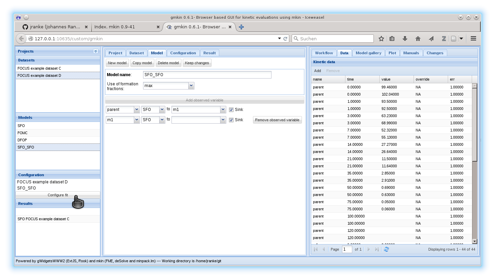

# gmkin

The R package **gmkin** provides a browser based graphical user interface (GUI) for
fitting kinetic models to chemical degradation data based on R package
[mkin](http://github.com/jranke/mkin). The GUI is based on the 
[gWidgetsWWW2](http://github.com/jverzani/gWidgetsWWW2) package developed by
John Verzani. The GUI elements are created by the JavaScript library
ExtJS which is bundled with gWidgetsWWW2.

## Installation

First you need to install gWidgetsWWW2:

```s
require(devtools)
install_github("gWidgetsWWW2", "jverzani")
```

Installing gWidgetsWWW2 yields a lot of warnings concerning overly long path
names. This is because the JavaScript library ExtJS is installed 
along with it which has lots of files with long paths to be installed.

Then you can install gmkin, also directly from github:

```s
install_github("gmkin", "jranke")
```

## Usage

You start the GUI from your R terminal with latest mkin installed as shown below. 
You may also want to adapt the browser that R starts (using
`options(browser="/usr/bin/firefox")` on linux, or setting the default browser
on Windows from the browser itself). Development was done with firefox. I also
did some testing with Chrome on Windows. Chrome sometimes hung when loading
the GUI and therefore ExtJS the first time, but when the GUI is loaded it appears
to work fine.

```s
require(gmkin)
gmkin()
```

The following screenshot is taken after loading the gmkin workspace with
an analysis of FOCUS dataset Z. It has to be saved as an .RData file 
first, and can then be loaded to the GUI.

```s
save(FOCUS_2006_Z_gmkin, file = "FOCUS_2006_gmkin_Z.RData")
```



## Status and known issues

- Starting the GUI takes some time. Once it is started, it is reasonably responsive.
- Do not delete the last dataset or the last model from the respective lists,
  this is not supported.
- The fit list is not always updated when using Firefox version 28 on Windows. This
  works with Firefox 29 and with Chrome.
- gmkin was developed in the hope that it will be useful. However, no warranty can be 
  given that it will meet your expectations. There may be bugs, so please be
  careful, check your results for plausibility and use your own expertise to judge
  yourself.
